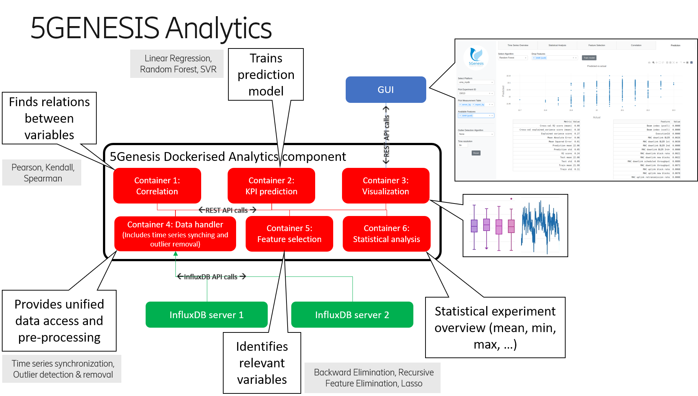

# 5Genesis Analytics Module - Containerized
The 5Genesis Analytics module provides methods for analysing and offline learning on the data that is provided by the platform monitoring.


## Requirements
Docker >= 18.06.0


## Installation
1. Install and start Docker.

2. Activate Docker Swarm (or replace this step with alternative deployment options, such as Kubernetes):
    1. Type 
    ```bash
    docker system info
    ```
    2. Look for "Swarm: active" or "Swarm: inactive"
    3. If "inactive", type the following to set up Docker Swarm:
    ```bash
    docker swarm init
    ```

3. Create a Docker Swarm secret by entering the connection details and credentials for each database connection:
    ```bash
    docker secret create analytics_connections - << END
    platform_name:      # replace platform_name, e.g. uma
        host: ip        # replace ip, e.g. 192.168.0.1
        port: p         # replace p with the port, e.g. 8080
        user: u         # replace u with the user name, e.g. user1
        password: pw    # replace pw with the password
        databases:
        - db_name1      # replace db_name1 with your database name(s)
        - db_name2      # replace or delete if there is only one database
    END
    ```

4. Create a Docker Swarm secret for user authentication. Users can only access experiment IDs that are encrypted with this secret. A master password access is also granted with this secret. Replace "secret123" with the actual secret string.
    ```bash
    echo secret123 | docker secret create analytics_secret -
    ```

5. Clone this repository.

6. Build and deploy containers with
    ```bash
    ./Analytics/install.sh
    ``` 
    Note that it will take some time to query and cache the experiment IDs at the first startup of the containers. Depending on the size of the data in the database, this could take from a few seconds to a few minutes before the containers are ready to use.


## Overview




## Usage
When the containers are up and running, a graphical user interface will be available at [http://localhost:5005/dash](http://localhost:5005/dash). The individual containers are also accessible through REST API as described below.

---
### Data Handler
---
The Data Handler container is the access point for the analytics algorithm containers to retrieve the data from different sources. Note: Access to this container will likely not be available to the end user through the GUI.

Access the Data Handler at [http://localhost:5000](http://localhost:5000).

An API description is available at [http://localhost:5000/api](http://localhost:5000/api) and includes the following commands:
- List all available datasources: [http://localhost:5000/get_datasources](http://localhost:5000/get_datasources)
- List all available experiments: [http://localhost:5000/get_all_experimentIds/datasource](http://localhost:5000/get_all_experimentIds/datasource)
- List available experiments for given measurement: [http://localhost:5000/get_experimentIds_for_measurement/datasource/measurementId](http://localhost:5000/get_experimentIds_for_measurement/datasource/measurementId)
- List available measurements for a given experiment: [http://localhost:5000/get_measurements_for_experimentId/datasource/experimentId](http://localhost:5000/get_measurements_for_experimentId/datasource/experimentId) 
- Retrieve data from a given experiment: [http://localhost:5000/get_data/datasource/experimentId](http://localhost:5000/get_data/datasource/experimentId)
    + Parameters:
        * measurement: e.g. Throughput_Measures (default all available measurements)
        * remove_outliers: zscore or mad (default none)
        * match_series: to synchronize data from multiple measurements (default false)
        * max_lag: time lag for synchronisation (default 1s)
        * limit: any integer to indicate a limit on the returned rows (default none)
        * offset: any integer to indicate the offset for the row limit (default none)
        * additional_clause: any InfluxDB clause (default none)
        * chunked: whether the results are retrieved from the server in chunks (default false)
        * chunk_size: any integer to define the chunk size (default 10000 if chunked is enabled)
- Retrieve data from two experiments (e.g. for correlation): [http://localhost:5000/get_data/datasource/experimentId1/experimentId2](http://localhost:5000/get_data/datasource/experimentId1/experimentId2)
    + Parameters same as above
- Clear the data handler's cache: [http://localhost:5000/purge_cache](http://localhost:5000/purge_cache)

<!--Example: http://localhost:5000/get_data/uma/499?measurement=Throughput_Measures&measurement=ADB_Resource_Agent&remove_outliers=mad&limit=10-->

Example output for /get_data/:
```yaml
{
    "ADB_Resource_Agent": {
        "Available RAM (MB)": {
            "0": 845,
            "1": 803,
            "2": 808,
            ...
        },
        ...
    },
    "Throughput_Measures": {
        "DL - AverageThput (Kbps)": {
            "0": 3617.0005,
            "1": 4436.538269,
            "2": 3900.982222,
            ...
        },
        ...
    }
}
```


---
### Correlation
---
The Correlation container enables the user to perform:
1. a cross-correlation on the fields within the same experiment (resulting in a correlation matrix), or
2. a correlation of the fields across different experiments (resulting in a list of correlation values).

Access the Correlation module at [http://localhost:5001](http://localhost:5001).

An API description is available at [http://localhost:5001/api](http://localhost:5001/api) and includes the following commands:
- Cross-correlation of fields within the same experiment: [http://localhost:5001/correlate/fields/datasource/experimentId](http://localhost:5001/correlate/fields/datasource/experimentId)
    + Parameters:
        * measurement: e.g. Throughput_Measures (default all available measurements)
        * method: any Pandas correlation method (default pearson)
        * remove_outliers: zscore or mad (default none)
        * field: filter for fields, e.g. Throughput
- Correlation of fields between different experiments: [http://localhost:5001/correlate/experiments/datasource/experimentId1/experimentId2](http://localhost:5001/correlate/experiments/datasource/experimentId1/experimentId2)
    + Parameters same as above

<!--Example: http://localhost:5001/correlate/fields/uma/499?measurement=ADB_Resource_Agent&measurement=Throughput_Measures&remove_outliers=mad-->

Example output for /correlate/fields/:
```yaml
{
    "correlation_matrix": {
        "DL - AverageThput (Kbps)": {
            "SNR": 0.21373483,
            "RSSI": 0.1842762049,
            ...
        },
        ...
    }
}
```

<!--Example: http://localhost:5001/correlate/experiments/uma/499/466?measurement=ADB_Resource_Agent&measurement=Throughput_Measures&remove_outliers=mad-->

Example output for /correlate/experiments/:

```yaml
{
    "correlation_list": {
        "Available RAM (MB)": 0.190006483,
        "DL - AverageThput (Kbps)": -0.0301038513, 
        ...
    }
}
```


---
### Prediction
---
The Prediction container enables the user to perform KPI prediction on a specified target KPI.

Access the Prediction module at [http://localhost:5002](http://localhost:5002).

An API description is available at [http://localhost:5002/api](http://localhost:5002/api) and includes the following commands:
- KPI Prediction using different algorithms: [http://localhost:5002/train/datasource/algorithm/target](http://localhost:5002/train/datasource/algorithm/target)
    + Algorithm:
        * Linear Regression: linreg
        * Random Forest: rf
        * Support Vector Regression (experimental): svr, linear_svr, nu_svr
    + Target: Target variable for prediction, e.g. "DL - AverageThput (Kbps)" 
    + Parameters:
        * drop_feature: any feature to be ignored for training (default None)
        * experimentid: e.g. 499 (at least one experiment ID is mandatory)
        * measurement: e.g. Throughput_Measures (default all available measurements)
        * normalize: not relevant for some algorithms, e.g. Random Forest or SVR (default False)
        * remove_outliers: zscore or mad (default none)
- Download the trained model: [http://localhost:5002/model](http://localhost:5002/model)

<!--Example: http://localhost:5002/train/uma/rf/DL%20-%20AverageThput%20(Kbps)?experimentid=499&measurement=Throughput_Measures&drop_feature=DL%20-%20MaximumThput%20(Kbps)&drop_feature=DL%20-%20MinimumThput%20(Kbps)&remove_outliers=mad-->

Example output for /train/:
```yaml
{
    "coefficients": {
        "DL - StatDTX Ratio": 0.6477855028,
        "DL - PDCCH Ratio": 0.1479913101,
        ...
    },
    "real_predicted_values": {
        "y_pred": {
            "0": 3814.6712453507,
            "1": 4633.0326365561,
            ...
        },
        "y_test": {
            "0": 3741.438577,
            "1": 4772.295,
            ...
        }
    },
    "results": {
        "R2 score": 0.7576147901,
        "Explained variance score": 0.7694582032,
        ...
    }
}
```


---
### Statistical Analysis
---
The Statistical Analysis container enables the user to perform KPI statistical validation.

Access the Statistical Analysis module at [http://localhost:5003](http://localhost:5003).

An API description is available at [http://localhost:5003/api](http://localhost:5003/api) and includes the following commands:
- KPIs statistical validation across experiments and measurement tables stored in InfluxDB: [http://localhost:5003/statistical_analysis/datasource](http://localhost:5003/statistical_analysis/datasource)
    + Parameters:
        * experimentid: e.g. 499 (at least one experiment ID is mandatory)
        * measurement: e.g. Throughput_Measures (at least one measurement is mandatory)
        * it: iteration identifier (default= '_iteration_')
        * kpi: e.g. 'Delay (ms)' (at least one kpi is mandatory)
        * unit: e.g. ms (default= None)
        * exptype' : [0,1] 0: if the experiments contain several kpi samples per iteration , 1: if the experiments contain one kpi sample per iteration (e.g. Service Creation Time) (default= 0)

<!--Example: http://localhost:5003/statistical_analysis/uma?experimentid=520&measurement=ADB_Ping_Agent&kpi=Delay%20(ms)-->

Example output for /statistical_analysis/:
```yaml
{
    "experimentid": {
        "520": {
            "Delay (ms)": {
                "Iteration Statistics": {
                    "0": {
                        "25% Percentile":54.800000000000004,	
                        "5% Percentile":24.259999999999998,
                        ...
                    },
                    "1": {
                        "25% Percentile":54.550000000000004,
                        "5% Percentile":25.61,
                        ...
                    },
                    ...
                },
                "Test Case Statistics": {
                    "25% Percentile": {
                        "Confidence Interval":1.0124404204175417,	
                        "Value":57.058
                    },
                    "5% Percentile": {
                    "Confidence Interval":1.1079808517791605,
                    "Value":24.4246
                    },
                    ...
                }
            }
        }
    }
}

```

<!--
Example: http://localhost:5003/statistical_analysis/uma?experimentid=520&experimentid=499&measurement=ADB_Ping_Agent&measurement=ADB_Resource_Agent&kpi=Delay%20(ms)&kpi=SNR

Output:
```yaml
{
    "experimentid": {
        "499": {
            "SNR": {
                "Iteration Statistics": {
                    "0": {
                        "25% Percentile":-2,    
                        "5% Percentile":-2,
                        ...
                    },
                    "1": {
                        "25% Percentile":-1,
                        "5% Percentile":-2,
                        ...
                    },
                    ...
                },
                "Test Case Statistics": {
                    "25% Percentile": {
                        "Confidence Interval":0.16935709896383863,   
                        "Value":-1.22
                    },
                    "5% Percentile": {
                    "Confidence Interval":0.12379377583188562,
                    "Value":-1.8660000000000003
                    },
                    ...
                }
            }

        },
        "520": {
            "Delay (ms)": {
                "Iteration Statistics": {
                    "0": {
                        "25% Percentile":54.800000000000004,    
                        "5% Percentile":24.259999999999998,
                        ...
                    },
                    "1": {
                        "25% Percentile":54.550000000000004,
                        "5% Percentile":25.61,
                        ...
                    },
                    ...
                },
                "Test Case Statistics": {
                    "25% Percentile": {
                        "Confidence Interval":1.0124404204175417,   
                        "Value":57.058
                    },
                    "5% Percentile": {
                    "Confidence Interval":1.1079808517791605,
                    "Value":24.4246
                    },
                    ...
                }
            },
            "SNR": {
                "Iteration Statistics": {
                    "0": {
                        "25% Percentile":30,    
                        "5% Percentile":30,
                        ...
                    },
                    "1": {
                        "25% Percentile":30,
                        "5% Percentile":30,
                        ...
                    },
                    ...
                },
                "Test Case Statistics": {
                    "25% Percentile": {
                        "Confidence Interval":0,   
                        "Value":30
                    },
                    "5% Percentile": {
                    "Confidence Interval":0,
                    "Value":30
                    },
                    ...
                }
            }

        }
    }
}

```
-->

If units inserted, they will be associated to the kpis in the same order of appearance. In the hereunder example only a unit is inserted, thus it will be associated to the first kpi, whilst the latter will be printed with no unit. Note that in this case the kpi "Delay (ms)" already comes with a unit within its name, that's why it's printed.

<!--Example: http://localhost:5003/statistical_analysis/uma?experimentid=520&measurement=ADB_Ping_Agent&measurement=ADB_Resource_Agent&kpi=SNR&kpi=Delay%20(ms)&unit=dB-->

Example output:
```yaml
{
    "experimentid": {
        "520": {
            "Delay (ms)": {
                "Iteration Statistics": {
                    "0": {
                        "25% Percentile":54.800000000000004,    
                        "5% Percentile":24.259999999999998,
                        ...
                    },
                    "1": {
                        "25% Percentile":54.550000000000004,
                        "5% Percentile":25.61,
                        ...
                    },
                    ...
                },
                "Test Case Statistics": {
                    "25% Percentile": {
                        "Confidence Interval":1.0124404204175417,   
                        "Value":57.058
                    },
                    "5% Percentile": {
                    "Confidence Interval":1.1079808517791605,
                    "Value":24.4246
                    },
                    ...
                }
            },
            "SNR - (dB)": {
                "Iteration Statistics": {
                    "0": {
                        "25% Percentile":30,    
                        "5% Percentile":30,
                        ...
                    },
                    "1": {
                        "25% Percentile":30,
                        "5% Percentile":30,
                        ...
                    },
                    ...
                },
                "Test Case Statistics": {
                    "25% Percentile": {
                        "Confidence Interval":0,   
                        "Value":30
                    },
                    "5% Percentile": {
                    "Confidence Interval":0,
                    "Value":30
                    },
                    ...
                }
            }

        }
    }
}

```

---
### Feature Selection
---
The Feature Selection container enables the user to select the most relevant features according to a specified target KPI.

Access the Feature Selection module at [http://localhost:5004](http://localhost:5004).

An API description is available at [http://localhost:5004/api](http://localhost:5004/api) and includes the following commands:
- Feature Selection using different algorithms: [http://localhost:5004/selection/datasource/algorithm/target](http://localhost:5004/selection/datasource/algorithm/target)
    + Algorithm:
        * Backward Elimination: backward, backward_elimination
        * Recursive Feature Elimination: RFE, rfe
        * Lasso Regression: LASSO, Lasso, lasso
    + Target: Target variable, e.g. "DL - AverageThput (Kbps)" 
    + Parameters:
        * drop_feature: any feature to be ignored for training (default None)
        * experimentid: e.g. 499 (at least one experiment ID is mandatory)
        * measurement: e.g. Throughput_Measures (default all available measurements)
        * normalize: relevant for RFE (default False)
        * alpha: relevant for Lasso (default 0.1)
        * remove_outliers: zscore or mad (default none)

<!--Example: http://localhost:5004/selection/uma/rfe/DL%20-%20AverageThput%20(Kbps)?experimentid=499&measurement=Throughput_Measures&drop_feature=DL%20-%20MaximumThput%20(Kbps)&drop_feature=DL%20-%20MinimumThput%20(Kbps)&remove_outliers=mad&normalize=true-->

Example output for /selection/:
```yaml
{
    "Features - Original": {
        "0": "DL - ACK Count",
        "1": "DL - ACK Ratio",
        ...
    },
    "Features - Selected": {
        "0": "DL - ACK Ratio",
        "1": "DL - Byte Count",
        ...
    },
    "Score": {
        "DL - ACK Ratio": 1428937721.858489,
        "DL - Byte Count": 5003183391.821027,
        ...
    }
}
```

---
### Visualization
---
The Visualization container enables the user to visualize the results of the other containers.

Access the Feature Selection module at [http://localhost:5005](http://localhost:5005).

The GUI can be accessed at [http://localhost:5005/dash/](http://localhost:5005/dash/).
Note that a user authentication token is required to access experiment results. The token contains the valid experiment IDs encrypted by the 5Genesis Portal. A secret is shared between the Portal and the Analytics to facilitate the exchange of the encrypted authenticated experiment IDs. The setup of this shared secret is described in step 5 in the installation instructions above. This secret also serves as a master password to access all experiment IDs.

With the encryption set up, the Analytics requires a token in the URL to receive the valid experiment IDs (or alternatively the master password): [http://localhost:5005/dash?token=ABCDE](http://localhost:5005/dash?token=ABCDE)
